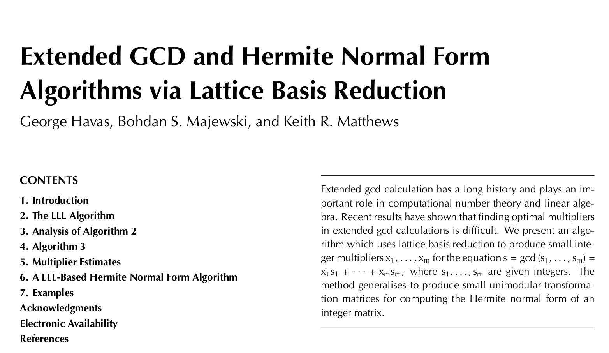

# LLL-HNF
We use LLL reduction to find the Hermite Normal Form of a matrix and solve linear diophantine equations. Complete writeup is available on [LeetArxiv](https://leetarxiv.substack.com/p/lll-applied-to-extended-gcd-hermite)



The 1998 paper _Extended GCD and Hermite Normal Form Algorithms via Lattice Basis Reduction_ (Havas, Majewski & Matthews, 1998) introduces the HMM algorithm for solving linear diophantine equations. 

We code the paper in C and test different cases.

Getting Started
```
clear && gcc LLLMatrix.c -lm -o m.o && ./m.o
```
